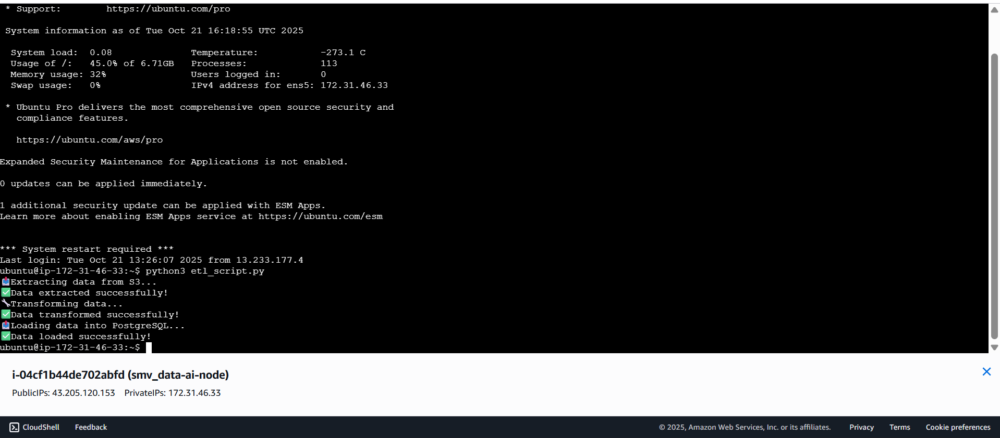
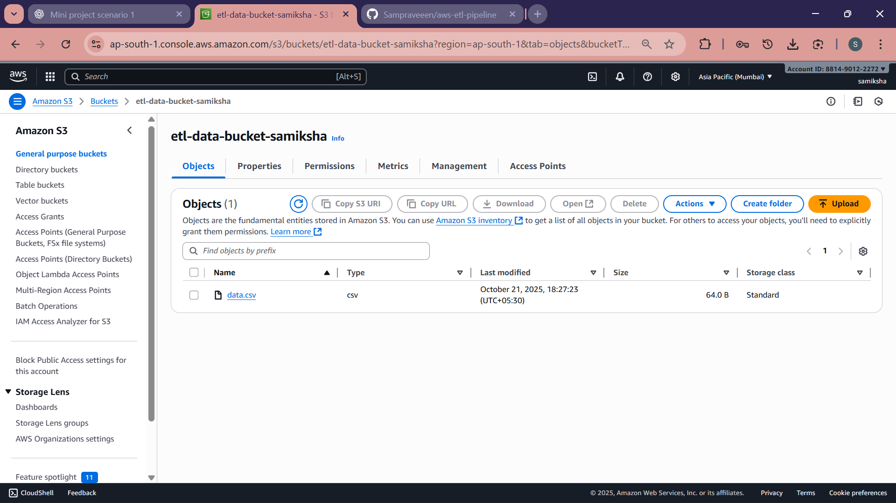
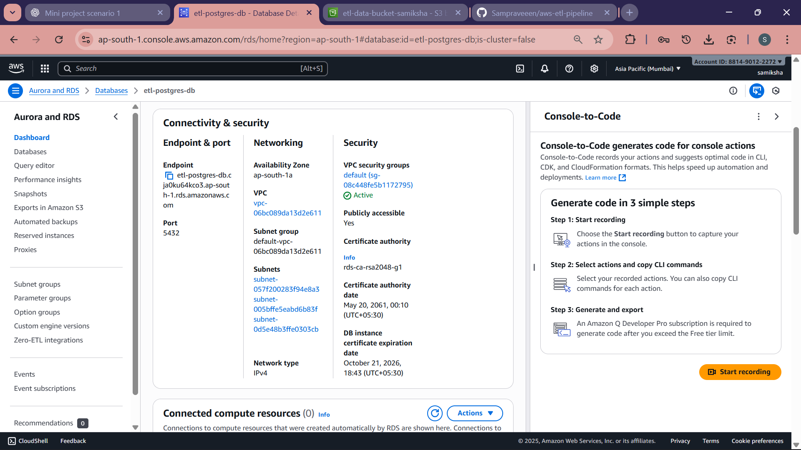

# AWS ETL Data Pipeline using Python, S3, EC2, and RDS PostgreSQL

**Developed by:** Samiksha P  
**Institution:** Sri Manakula Vinayagar Engineering College, Puducherry  

---

## 💡 Project Overview

This project demonstrates a complete **ETL (Extract, Transform, Load)** data pipeline built on **AWS Cloud**.  
The goal is to extract data from an Amazon **S3 bucket**, transform it using **Python and Pandas** on an **EC2 instance**, and then load the cleaned data into an **Amazon RDS (PostgreSQL)** database.

This project helped me understand how different AWS services work together to automate data movement and transformation in a real-world cloud environment.

---

## ☁️ AWS Services Used

1. **Amazon S3** – Stores the raw input data files (e.g., `data.csv`)
2. **Amazon EC2** – Hosts and runs the Python ETL script
3. **Amazon RDS (PostgreSQL)** – Stores the processed and transformed data
4. **IAM** – Manages secure AWS access permissions
5. **Security Groups** – Controls inbound and outbound traffic between AWS components

---

## ⚙️ How the ETL Pipeline Works

1. Upload the input CSV file to an **S3 bucket** (e.g., `etl-data-bucket-samiksha`).
2. Launch an **EC2 instance** and connect via SSH.
3. Run the **Python ETL script** on EC2 – it connects to S3 using **Boto3** and downloads the data.
4. The data is cleaned or transformed (for example, converting height from inches to centimeters).
5. The transformed data is inserted into an **RDS PostgreSQL** database using **Psycopg2**.
6. The console displays messages after every successful step.

---

## 🧰 Technologies and Tools Used

- Python 3  
- Pandas  
- Boto3  
- Psycopg2  
- AWS EC2  
- AWS S3  
- AWS RDS (PostgreSQL)  
- Ubuntu 24.04 LTS  

---

## 📂 Folder Structure

AWS_ETL_Pipeline/
│
├── etl_script.py # Main ETL Python script
├── requirements.txt # Python dependencies
├── README.md # Documentation file
└── screenshot/ # Project screenshots
├── Ec2_output.png
├── S3-bucket.png
└── rds-instance.png

---

## 🧾 Example Input (data.csv)

name,height_in
Alice,60
Bob,70
Charlie,65

---

## 🖥️ Example Console Output

📥 Extracting data from S3...
✅ Data extracted successfully!
🔧 Transforming data...
✅ Data transformed successfully!
📤 Loading data into PostgreSQL...
✅ Data loaded successfully!

yaml
Copy code

---

---

## 🎓 What I Learned

Through this project, I learned how to:
- Integrate **EC2, S3, and RDS** for end-to-end data workflows  
- Use **IAM roles and security groups** safely  
- Handle data transformation using **Pandas**  
- Connect and load data into **PostgreSQL** using **Psycopg2**  
- Manage and troubleshoot AWS services effectively  

This project strengthened my understanding of **data engineering** on the **AWS cloud**.

---

## 🚀 Future Enhancements

- Automate ETL execution using **AWS Lambda** and **EventBridge**  
- Add monitoring and error logging via **AWS CloudWatch**  
- Scale pipeline for large datasets  
- Create a dashboard for data visualization and reporting  

---

## 📸 Project Screenshots

| Step | Description | Screenshot |
|------|--------------|-------------|
| 1️⃣ | **EC2 Instance Running ETL Script Successfully** |  |
| 2️⃣ | **S3 Bucket with Uploaded Data File (data.csv)** |  |
| 3️⃣ | **RDS PostgreSQL Database Connection (Endpoint Visible)** |  |

---

## 🌐 Repository Overview

This repository contains an **AWS-based ETL data pipeline** built using **Python, S3, EC2, and PostgreSQL (RDS)**.  
It demonstrates how to integrate multiple AWS services to automate data extraction, transformation, and loading into a database.

**GitHub Repository:** [https://github.com/Sampraveeen/aws-etl-pipeline](https://github.com/Sampraveeen/aws-etl-pipeline)

---

## 🧠 About This Project

This project was developed as part of my **academic cloud and AI practicals**, focusing on integrating cloud-based data workflows and preparing datasets for **AI-driven analytics**.

It represents a key step in understanding how cloud data pipelines work in real-world systems.

---

*This repository was created purely for educational and demonstration purposes.*  
*© 2025 Samiksha P*
