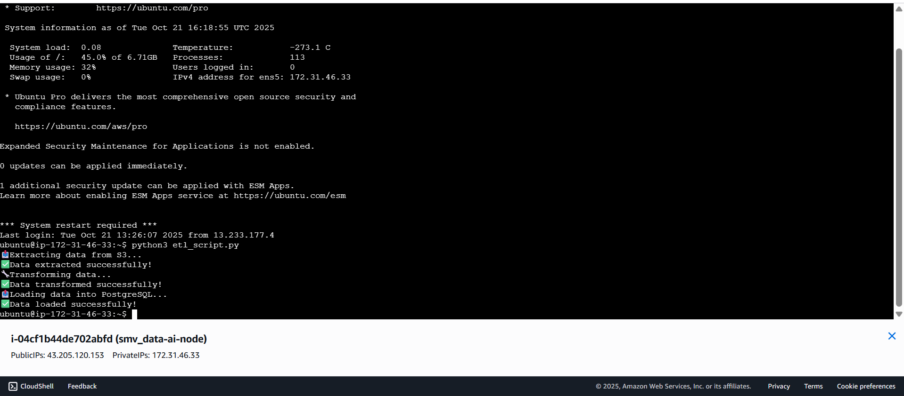
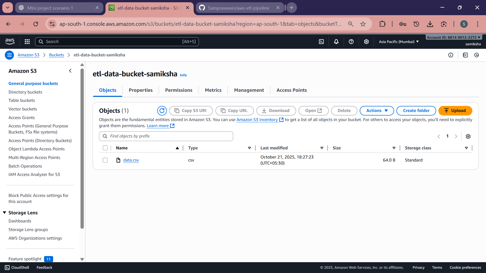
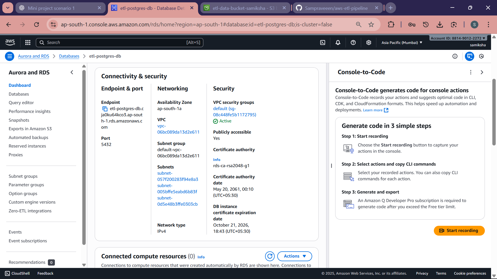
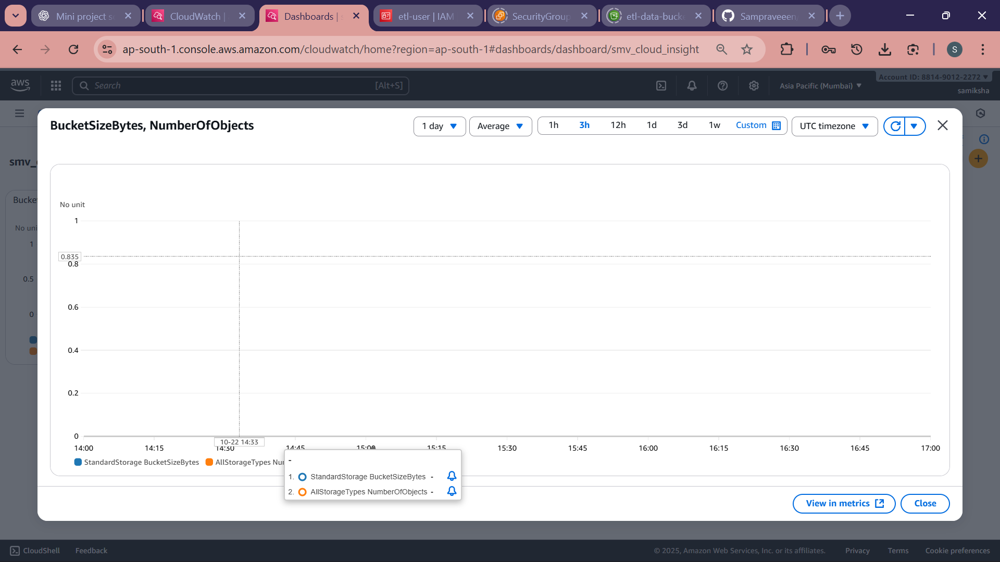
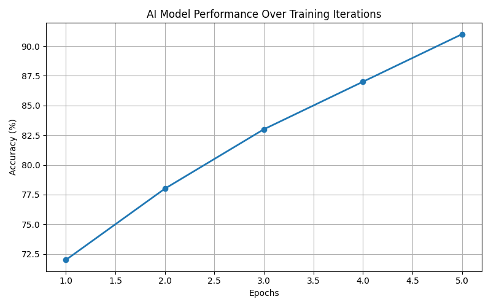
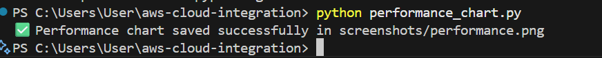

# 🌩️ AWS Cloud Integration — Unified Data & AI System

**Developed by:** Samiksha P  
Sri Manakula Vinayagar Engineering College, Puducherry  

---

## 🌍 Project Overview
This project demonstrates a **complete cloud-integrated analytics system** that unifies data, AI, and automation within AWS.  
It combines services like **S3, EC2, RDS, CloudWatch, and GitHub Actions** to build a continuous workflow for monitoring, data processing, and insight generation.  

This scenario extends previous ETL and AI modules into a **single integrated platform** — supporting CI/CD deployment, data-lake analytics, and performance monitoring.

---

## 🧠 Use Case
**AI-driven dynamic pricing algorithms** hosted on secured cloud servers using protected transaction data.  
The integrated system dynamically extracts, transforms, analyzes, and monitors data, offering real-time visibility into performance metrics.

---

## ☁️ AWS Services Used
| Service | Purpose |
|----------|----------|
| **Amazon S3** | Centralized data-lake storage for unified datasets |
| **Amazon EC2** | Cloud instance to host and execute ETL & AI workflows |
| **Amazon RDS (PostgreSQL)** | Database for structured data integration |
| **Amazon CloudWatch** | Real-time system performance dashboard |
| **AWS IAM** | Identity and permission management for all components |
| **GitHub Actions (CI/CD)** | Automated deployment and workflow validation |

---

## ⚙️ Workflow & Automation
The CI/CD workflow (`.github/workflows/deploy.yml`) automatically:
1. Checks out the repository  
2. Sets up the Python environment  
3. Installs all dependencies (Matplotlib, Pandas, Boto3)  
4. Runs the **performance analytics script**  
5. Uploads visualization artifacts for cloud performance insights  

✅ Ensures a smooth, zero-manual-deployment process.

---

## 🧩 Project Components
aws-cloud-integration/
│
├── .github/
│ └── workflows/
│ └── deploy.yml # CI/CD pipeline automation
│
├── screenshots/ # Proof of AWS setup and output
│ ├── S3-bucket.png
│ ├── rds-instance.png
│ ├── Ec2_output.png
│ ├── cloudwatch-dashboard.png
│ ├── performance.png
│ └── performance-chart.png
│
├── performance_chart.py # Script for performance analytics
└── README.md # Project documentation

---

## 📊 Performance Insights
The analytics script generates a real-time visualization of data metrics and saves it as:

✅ Performance chart saved successfully in screenshots/performance.png

Example Output:

Performance chart saved successfully!
Chart file: screenshots/performance.png

---

## 📸 Screenshots Gallery
| Description | Screenshot |
|--------------|-------------|
| EC2 Instance Execution |  |
| S3 Bucket (Data Lake) |  |
| RDS Instance |  |
| CloudWatch Dashboard |  |
| Performance Visualization |  |
| Performance Terminal Proof |  |

*(Add `workflow-success.png` once your CI/CD pipeline completes successfully.)*

---

## 🔒 Security & Audit
- IAM-based access controls restrict unauthorized actions.  
- Security Groups manage SSH and DB ports precisely.  
- Data is encrypted both **at rest and in transit** using AWS-managed keys.  

---

## 🧾 Key Learnings
- Integrated multi-service AWS deployments (S3 + EC2 + RDS + CloudWatch).  
- Automated performance workflows using **GitHub Actions**.  
- Visualization of analytics metrics with **Matplotlib and Pandas**.  
- Cloud security management with IAM and SG policies.  

---

## 🚀 Future Improvements
- Expand CI/CD to include **Lambda-triggered auto-deployments**.  
- Extend data-lake analytics using **AWS Glue & Athena**.  
- Integrate dashboard metrics directly into **Grafana**.  
- Add predictive monitoring using **AI-based anomaly detection**.  

---

## 📘 Summary
Scenario 3 completes the full-stack cloud integration pipeline —  
from **data ingestion (S3)** → **transformation (EC2)** → **storage (RDS)** → **monitoring (CloudWatch)** → **automation (CI/CD)**.  

This solution showcases a **modern, scalable, and secure AWS data platform** for real-time AI-driven business insights.

---

*GitHub Repository:* [https://github.com/Sampraveeen/aws-cloud-integration](https://github.com/Sampraveeen/aws-cloud-integration)

---